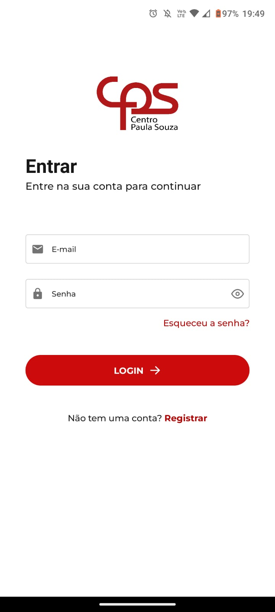
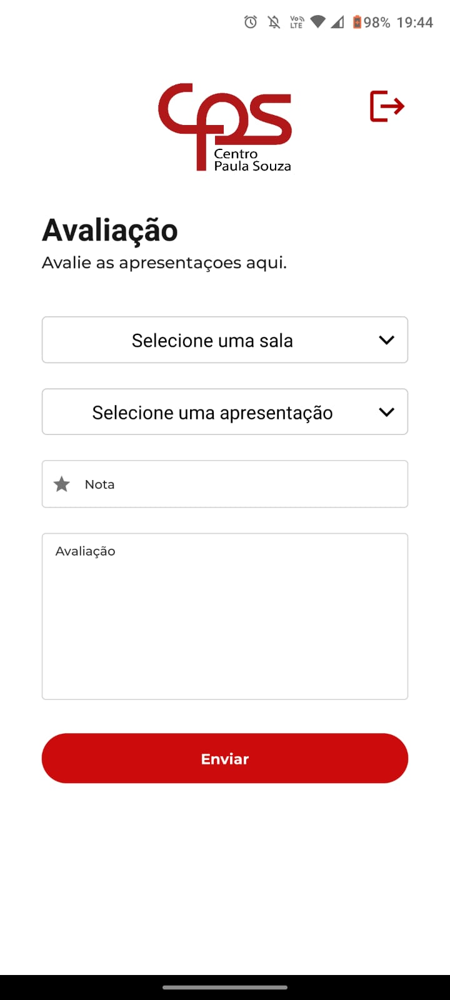
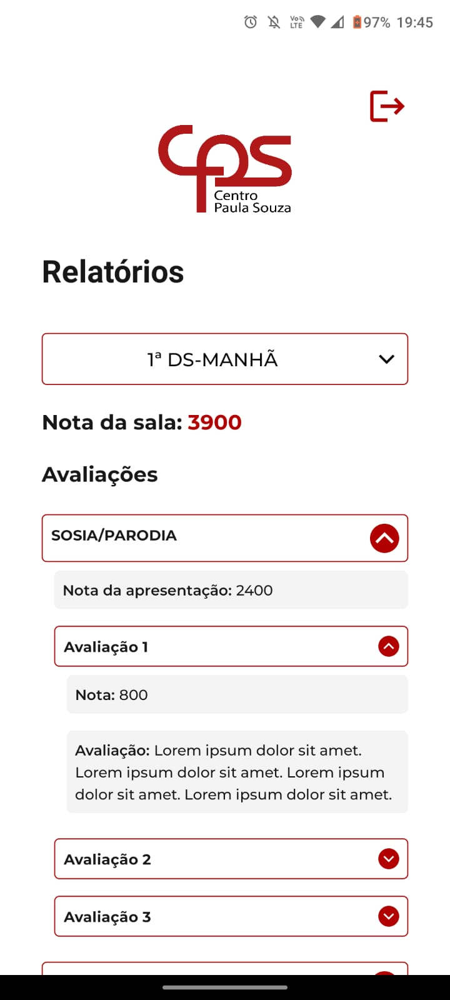
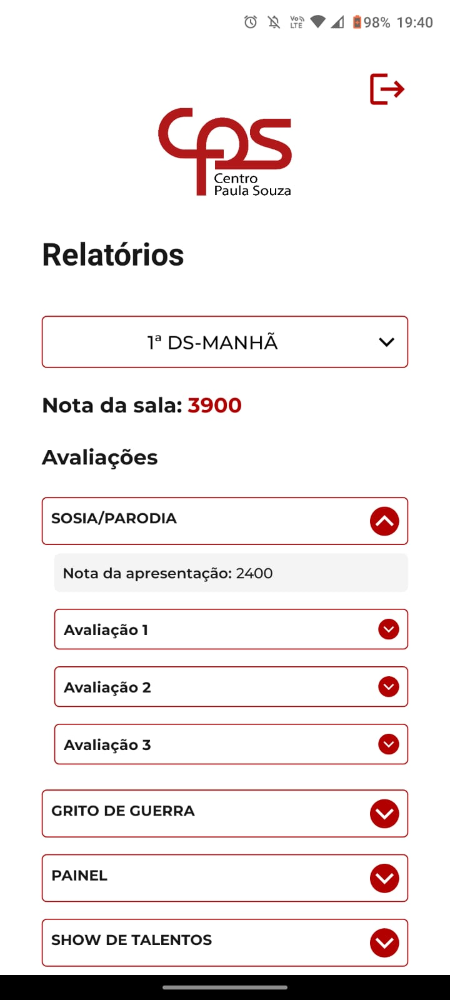

<h1 align=center>PROJETO-GERENCIADOR-DE-VOTOS-SPF</h1>

<p align="center">
  
</p>

#
### SOBRE

- Projeto desenvolvido com o objetivo de melhorar o funcionamento de votação e auditoria das apresentações realizadas na Semana Paulo Freire, possibilitando uma melhor experiência dos participantes nessa sequência de demonstrações culturais e lúdicas.
- O período de levantamento de requisitos e desenvolvimento foi de 05/04/2023 até 15/04/2023.
- O projeto foi solicitado pelo professor do curso MTEC-Desenvolvimento de Sistemas na Etec Cidade Tiradentes, Everson Willian Pereira Bacelli.

#
### DESENVOLVEDORES

- <b>*Back-End*</b>: Kaique Souza Santos
- <b>*Mobile*</b>: Wiliam Melo da Mota

#
### TELAS

<p align="center">
  
  
  
  
  
  
  
</p>

#
### TECNOLOGIAS

&nbsp;
&nbsp;
&nbsp;

&nbsp;
&nbsp;
&nbsp;
&nbsp;
&nbsp;
&nbsp;
&nbsp;
&nbsp;

#
### DOCUMENTACAO DA API

```
<host>:<porta>/swagger-ui/index.html#
```

#
### CONTRIBUIÇÃO

```
$ git clone https://github.com/kaiquesouzasantos/projeto-gerenciador-votos-spf-etec-ct.git
```
